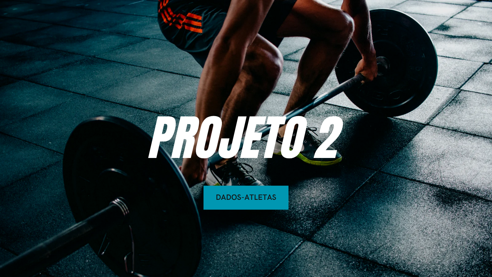

# 🏋️ Segundo Projeto em JS (Dados Atletas)

## 🔍 Sobre o Projeto

Este projeto consiste em uma aplicação desenvolvida em JavaScript para a gestão e análise de dados de atletas. O software utiliza Programação Orientada a Objetos (POO) com a classe `Atleta` para calcular parâmetros essenciais como Categoria, Índice de Massa Corporal (IMC) e a Média Válida das notas de desempenho.

## 🎯 Objetivo

Criar uma solução robusta e modular em JavaScript, utilizando classes, capaz de receber as informações básicas de um atleta, aplicar regras de negócio específicas e exibir todos os resultados de forma clara.

## ⚙️ Tecnologias Utilizadas

* **Linguagem:** JavaScript (ES6+ Classes)
* **Ambiente:** Node.js (para execução em console) ou qualquer ambiente JavaScript moderno.

## 📁 Estrutura do Projeto

O projeto é centralizado em uma única classe, que encapsula todos os dados e lógica.

## 🛠️ Classe Principal: `Atleta`

A classe `Atleta` é o núcleo do projeto, responsável por armazenar os atributos e realizar todos os cálculos necessários.

### Atributos

| Atributo | Descrição |
| :--- | :--- |
| `nome` | Nome completo do atleta. |
| `idade` | Idade do atleta (em anos). |
| `peso` | Peso do atleta (em kg). |
| `altura` | Altura do atleta (em metros). |
| `notas` | Array de notas de desempenho. |

### Métodos Principais

| Método | Função | Regras Aplicadas |
| :--- | :--- | :--- |
| `calculaCategoria()` | Define a faixa etária do atleta. | Infantil (9-11), Juvenil (12-13), Intermediário (14-15), Adulto (16-30), Sem Categoria (demais). |
| `calculaIMC()` | Calcula o Índice de Massa Corporal. | IMC = Peso / (Altura * Altura). |
| `calculaMediaValida()` | Calcula a média das notas. | Descarte da maior e da menor nota antes de calcular a média. |